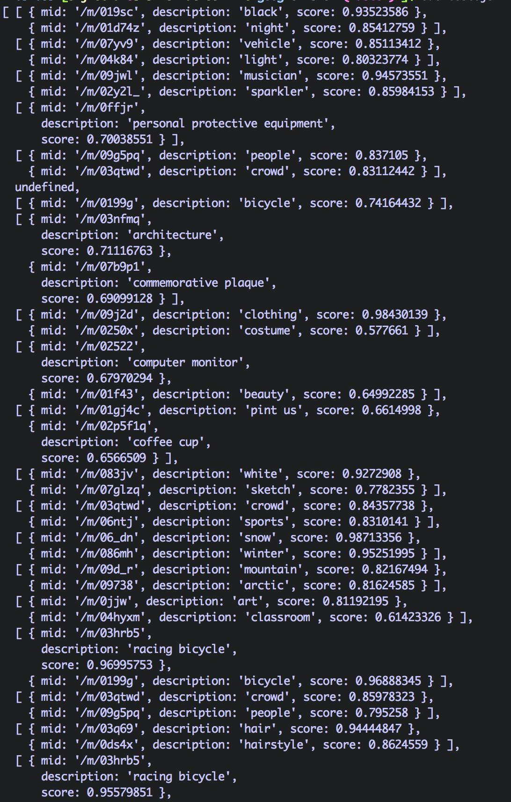

# ins-goo-vision
A module that user can pass their instagram API key and google vision API key and return the results of each of your image in your instagram.

## Usage
You need to provide your instagram `access_token` and your google vision api `key`.

```js
var insGooVision = require('ins-goo-vision');
insGooVision(YOUR_INS_ACCESS_TOKEN, YOUR_GOOGLE_VISION_KEY, callback);
```

You can also pass in these keys via `.env`

Results will be an array contain all your recent Ins images and its google vision results

## Part of the results

